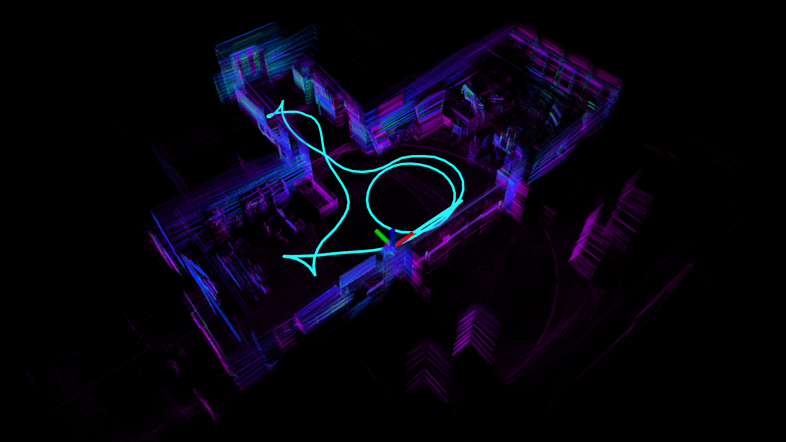

# IGE_LIO (Under Continuous Update)

## 1. Prerequisites
### 1.1 **Ubuntu** and **ROS**

* Ubuntu >= 18.04.
* ROS    >= Melodic.
* PCL    >= 1.8.
* Eigen  >= 3.3.4.
### 1.2 **livox_ros_driver**
Follow [livox_ros_driver Installation](https://github.com/Livox-SDK/livox_ros_driver).


## 2. Build
Clone the repository and catkin_make:

```
    cd ~/$A_ROS_DIR$/src
    git clone https://github.com/tapowanliwuyun/IGE_LIO.git
    cd IGE_LIO
    cd ..
    catkin_make
    source devel/setup.bash
```
## 3 Run IGE_LIO


### 3.1  Our private dataset


run our datasets 

```
roslaunch ig_lio mapping_my_rs_hall_IGE_LIO.launch
rosbag play xxx.bag
```




Download the private datasets on website ([Our private DATASET](https://drive.google.com/drive/folders/1Ak3TDvdyVSKqFxEqssSO31hpNjeRDSrK)) 

### 3.2 LiDAR_Degenerated Dataset


Download the LiDAR_Degenerate.bag files via OneDrive ([FAST-LIVO-Datasets](https://connecthkuhk-my.sharepoint.com/:f:/g/personal/zhengcr_connect_hku_hk/Esiqlmaql0dPreuOhiHlXl4Bqu5RRRIViK1EyuR4h1_n4w?e=fZdVn0)) 


## 4 Important parameters

Edit `config/xxx.yaml` and  `launch/xxx.launch` to set the below parameters:

1. `config/xxx.yaml`

* lid_topic: The topic name of LiDAR data.
* imu_topic: The topic name of IMU data.
* lidar_type: The type of LiDAR.
* scan_line: The scan line of LiDAR.
* lookfor_min_num: find the number of points with less intensity than the current point, the value is 2 indoors and 1 outdoors.
* lookfor_max_num: find the number of points that have little difference in strength compared to the current point, the value is 2 indoors and 1 outdoors.
* vertical_degree: LiDAR vertical field of view angle.
* image_fov_resolution: Image horizontal resolution.
* current_range_max_livox_hap: the maximum usage distance of laser points.

2. `launch/xxx.launch`
* edge_plane_flag: 1 represents using only edge feature points (geometric edge points and intensity edge points) 2 represents using only geometric planar points 3 represents using all three feature points.
* point_filter_num: The sampling interval for a new scan. It is recommended that `3~4` for faster odometry, `1~2` for denser map.
* filter_size_map: Downsample the  points in LiDAR global map. It is recommended that `0.2~0.3` for indoor scenes, `0.3~0.5` for outdoor scenes.
* filter_size_surf: Downsample the geometric planar points in a new scan. It is recommended that `0.2~0.4` for indoor scenes, `0.3~0.5` for outdoor scenes.
* filter_size_edge: Downsample the geometric edge points in a new scan. It is recommended that `0.05~0.2` for indoor scenes, `0.2~0.5` for outdoor scenes.
* filter_size_inten_edge: Downsample the points in a new scan. It is recommended that `0.05~0.2` for indoor scenes, `0.2~0.5` for outdoor scenes.

## 5. Acknowledgements
Thanks for [FAST-LIO2](https://github.com/hku-mars/FAST_LIO). Thanks for these outstanding work and its contributors.
